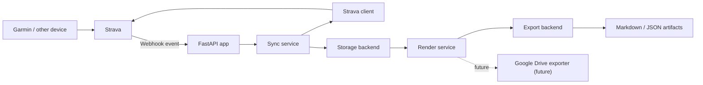
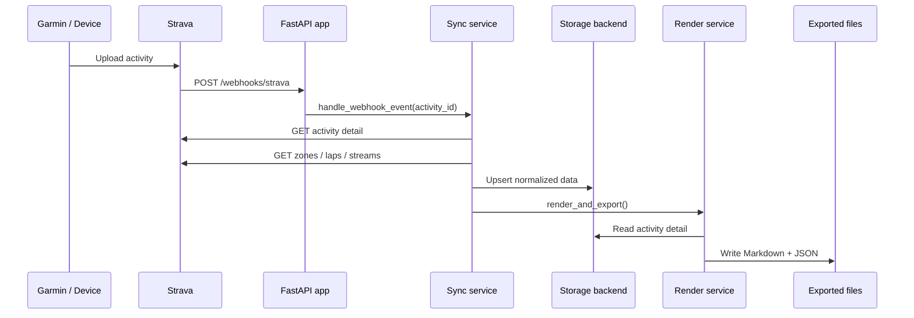

# Architecture

## High-level Overview

The application is a FastAPI backend that can run locally or on Vercel. It keeps a normalized Strava mirror through a pluggable storage backend and renders deterministic artifacts for AI and automation consumers.

## Request and Sync Flow

## Runtime Components

- `FastAPI app`: OAuth endpoints, webhook verification, webhook intake, cron endpoint, and health checks.
- `Strava client`: Handles OAuth token exchange, token refresh, and Strava API calls.
- `Sync service`: Fetches full activity detail and updates local storage.
- `Backfill service`: Runs bounded first-start and manual trailing-window backfills.
- `Scheduler`: Used only for local process deployments.
- `Storage backend`:
  - `SQLite` for local development
  - `Vercel Blob` for Vercel deployments
- `Render service`: Deterministically renders Markdown and JSON exports.
- `Exporter`:
  - local filesystem for local development
  - Vercel Blob for Vercel deployments
  - future Drive sync boundary

## Sync Strategy

- `Startup sync`: Used in local process deployments to immediately check the trailing 30-day window.
- `Initial seed`: On the first successful auth with an empty repository, the app runs a bounded seed sync.
- `Webhook path`: New or updated Strava activities are fetched immediately with streams, zones, and laps so recent workouts have the richest detail.
- `Scheduled path`:
  - local deployments use the in-process 16-minute scheduler
  - Vercel deployments use the `/api/cron/reconcile` endpoint configured in `vercel.json`
- `Manual backfill`: The CLI backfill command uses the same bounded, stream-free strategy and can be run repeatedly to grow historical coverage without rate-limit spikes.

## Deployment Notes

- The primary deployment target is now Vercel.
- Vercel should use:
  - `api/index.py` as the FastAPI function entrypoint
  - `vercel.json` for the scheduled reconciliation endpoint
  - `Vercel Blob` for durable state and exported artifacts
- Webhooks are the preferred freshness path. The cron job acts as reconciliation rather than the primary ingestion trigger.
- Local development still supports SQLite and local files so the repo remains easy to run without cloud resources.
