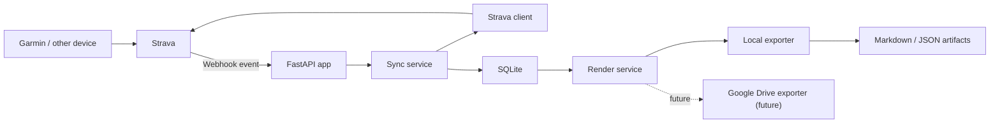
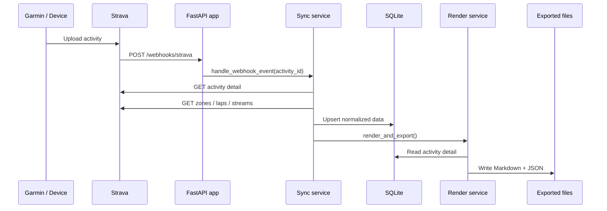

# Architecture

## High-level Overview

The application is a local-first backend service that keeps a normalized SQLite mirror of Strava activity data and renders deterministic artifacts for AI and automation consumers.

## Request and Sync Flow

## Runtime Components

- `FastAPI app`: OAuth endpoints, webhook verification, webhook intake, and health checks.
- `Strava client`: Handles OAuth token exchange, token refresh, and Strava API calls.
- `Sync service`: Fetches full activity detail and updates local storage.
- `Backfill service`: Runs first-start and manual trailing-window backfills.
- `Scheduler`: Runs periodic reconciliation to catch missed webhook events.
- `SQLite`: Source of truth for normalized activity data and sync state.
- `Render service`: Deterministically renders `dashboard.md`, `recent_activities.md`, `training_load.md`, `activity_index.json`, and per-activity Markdown.
- `Exporter`: Writes artifacts locally now and provides a future boundary for Drive sync.

## Deployment Notes

- v1 is optimized for a single container and bind-mounted storage.
- Webhooks are the preferred trigger, but the service still works with reconciliation-only sync if webhook delivery is not reachable.
- The same codebase can run on a laptop, NAS, Raspberry Pi, or small VM without swapping infrastructure components.
