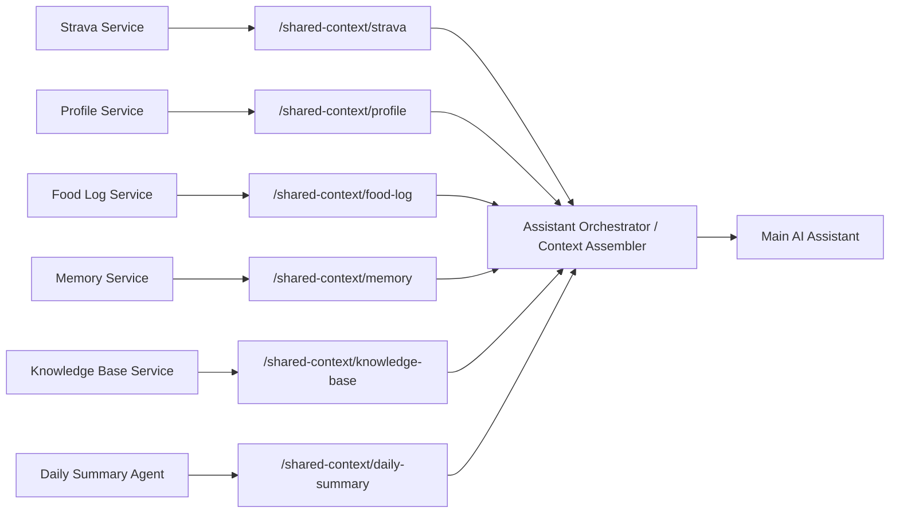
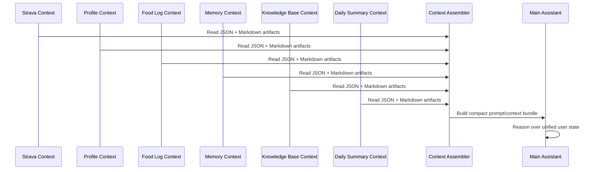

# Shared Context Architecture

## Purpose

This document defines how the Strava service fits into a larger local-first AI system where multiple microservices and specialist agents publish context for a single assistant.

The goal is to keep service ownership clear while making it easy for an AI assistant to consume the right context without coupling directly to every service database.

## Core Principles

- Each microservice owns its own database and internal schema.
- No service reads another service's private SQLite database directly.
- Shared context is published as generated artifacts in a common local folder.
- JSON is the primary machine-to-machine exchange format.
- Markdown is the readable companion format for humans and LLM context windows.
- The "big" assistant should read assembled context, not raw normalized tables.
- MCP is optional and can be added later if this closed local system needs to become externally consumable.

## Recommended System Shape

The local machine hosts a small collection of services and agents:

- `strava-service`: Syncs Strava activities and publishes training context.
- `profile-service`: Publishes user profile, preferences, constraints, and goals.
- `food-log-service`: Publishes food intake, meal summaries, and nutrition rollups.
- `memory-service`: Publishes durable user memory and recurring facts.
- `knowledge-base-service`: Publishes curated reference documents and structured notes.
- `daily-summary-agent`: Produces daily rollups from multiple sources.
- `assistant-orchestrator`: Reads all published context and prepares the final bundle for the main AI assistant.

This model supports both classic microservices and specialist AI agents. The important part is that each producer writes stable artifacts to the shared context directory.

## Why This Model

This repo should not become a centralized database for the whole system.

Instead:

- Strava remains responsible for training data only.
- Other services remain free to change their own storage schemas.
- The shared folder becomes the interoperability layer.
- The assistant gets predictable, compact, inspectable context files.

This is simpler than introducing MCP or direct DB sharing for a closed single-machine system.

## Context Sharing Strategy

The recommended integration pattern is:

1. Each service stores canonical data in its own database.
2. Each service renders derived context artifacts into a shared local folder.
3. A higher-level assembler or assistant reads those artifacts.
4. The assistant builds a user-specific context bundle before invoking the LLM.



## Recommended Shared Folder Contract

The shared folder should be readable by all local services that need context, but writable only by the owning service.

Suggested layout:

```text
/shared-context/
  /strava/
    dashboard.md
    dashboard.json
    recent_activities.md
    recent_activities.json
    training_load.md
    training_load.json
    activity_index.json
    /activities/
      /2026/
        2026-04-05--ride--17984785574.md
  /profile/
    profile.md
    profile.json
  /food-log/
    food_log.md
    food_log.json
    daily_intake.json
  /memory/
    memory.md
    memory.json
  /knowledge-base/
    kb_index.json
    notes.md
    /documents/
  /daily-summary/
    latest.md
    latest.json
    /history/
```

## Format Rules

To keep the system predictable, use the following rules:

- Every top-level context artifact should have a stable filename.
- JSON should be the canonical shared format for automation and service integration.
- Markdown should be optimized for human readability and LLM prompting.
- Timestamps should be ISO 8601.
- IDs should be preserved from the source system where possible.
- Derived summaries should be reproducible from the service's source of truth.
- Services should overwrite their own latest snapshot files atomically when practical.

## Role of the Strava Service

The Strava service is responsible for training and activity context only.

Its shared-context contract should remain focused on:

- current training dashboard
- recent activities
- training load
- machine-readable activity index
- per-activity deep dives when useful

Recommended Strava outputs:

- `dashboard.md`
- `dashboard.json`
- `recent_activities.md`
- `recent_activities.json`
- `training_load.md`
- `training_load.json`
- `activity_index.json`
- `activities/<year>/<date>--<sport>--<activity_id>.md`

The Strava SQLite database remains private to the Strava service.

## Other Recommended Producers

### Profile Service

The profile service should publish stable user identity and preference context:

- goals
- preferred sports
- constraints and injuries
- schedule constraints
- coaching style preferences
- important biometrics or thresholds that are not owned by Strava

### Food Log Service

The food log service should publish structured intake context:

- meals
- calories
- macros
- hydration
- timing around workouts
- daily and weekly summaries

This should be focused on facts and summaries, not free-form reasoning.

### Memory Service

The memory service should publish durable facts that help the assistant personalize responses:

- recurring routines
- long-term preferences
- recurring issues
- things the user wants remembered

This is not a training log. It is the persistence layer for personal continuity.

### Knowledge Base Service

The knowledge base service should publish curated reference information that may influence recommendations:

- training philosophy notes
- internal coaching docs
- race plans
- injury protocols
- medical or nutrition guidance approved for use in the system

This is especially useful when the assistant should follow a house style or a fixed coaching framework.

### Daily Summary Agent

The daily summary agent can read from the other context producers and publish a compact daily overview:

- what training happened
- what food was logged
- any readiness or recovery notes
- notable deviations from plan

This is a good place for lightweight synthesis that avoids forcing the main assistant to inspect every source on every request.

## Main Assistant Integration

The main assistant should not query each microservice database directly.

Instead, it should read from a context assembler that builds a user-specific bundle from the shared folder.



The context assembler can remain very simple in v1:

- read the latest JSON files
- choose a few markdown summaries
- trim the payload to the relevant time window
- produce one compact context object for the assistant

## Recommended Assistant Bundle Shape

A simple structure like this is enough to start:

```json
{
  "profile": {},
  "strava": {
    "dashboard": {},
    "recent_activities": [],
    "training_load": {},
    "dashboard_markdown": "...",
    "recent_markdown": "...",
    "training_load_markdown": "..."
  },
  "food_log": {},
  "memory": {},
  "knowledge_base": {},
  "daily_summary": {}
}
```

This keeps the assistant input explicit and easy to inspect during debugging.

## MCP and CLI Positioning

At this stage:

- MCP is not required for local closed-system context sharing.
- CLI remains useful for maintenance, debugging, and one-off rebuilds.
- HTTP APIs may still be useful for service health, admin operations, or future remote access.

Recommended rule:

- use local files for shared AI context
- use CLI for operations
- use HTTP for service management and exact lookups
- add MCP later only if external agents or standardized tool access become necessary

## Implementation Guidance for This Repo

For this Strava repo, the next clean step is to expand the export set with JSON companions for the existing Markdown reports.

Recommended additions:

- `dashboard.json`
- `recent_activities.json`
- `training_load.json`

That keeps the current Markdown workflow intact while making the service much easier to integrate into the broader assistant system.

## Non-goals

This shared-context model does not require:

- a shared SQL database
- direct cross-service table access
- a centralized monolithic datastore
- MCP as the primary local integration method
- live RPC between every service for every assistant request

The design intentionally favors stable local artifacts over tightly coupled runtime dependencies.
