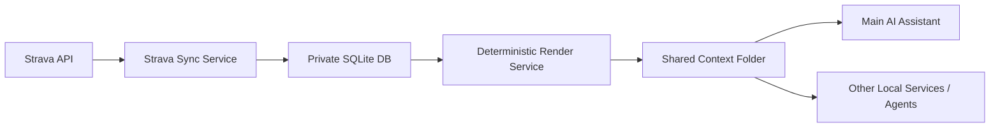

# Strava Shared Context Contract

## Purpose

This document defines the Strava-specific shared-context contract for this repo.

It applies the broader shared-context strategy in a focused way: the Strava service owns its private SQLite database, then publishes deterministic Markdown and JSON artifacts for other local services and AI agents.

## Why This Exists

The Strava service should not share its SQLite database directly with other microservices or agents.

Instead, it should publish stable derived artifacts that are:

- easy for an AI agent to read
- easy for other local services to parse
- safe to evolve without exposing internal tables
- deterministic and reproducible from local storage

This keeps Strava as a bounded training-data service while still making its context broadly usable.

## Source of Truth and Published Artifacts

The Strava source of truth remains:

- SQLite activity records
- zones
- laps
- streams
- sync state

The service then publishes:

- Markdown reports for humans and LLM-friendly context
- JSON companion files for machine-to-machine consumption

Rule:

- SQLite is canonical for storage
- JSON is canonical for shared context exchange
- Markdown is the readable companion representation

## Context Publishing Model



## Shared Output Folder

The Strava service should publish into a dedicated Strava folder inside the local shared context root.

Recommended shape:

```text
/shared-context/
  /strava/
    dashboard.md
    dashboard.json
    recent_activities.md
    recent_activities.json
    training_load.md
    training_load.json
    activity_index.json
    /activities/
      /2026/
        2026-04-05--ride--17984785574.md
```

In this repo today, the equivalent publish location is the existing export directory, usually:

```text
data/exports/
```

That export directory already acts like the Strava shared-context publish folder for local development and Docker usage.

## Export Contract

### `dashboard.md`

Primary human-readable Strava summary.

Intended audience:

- user inspection
- AI prompt context
- debugging recent training state

Contents:

- last 7 days
- current week
- previous week
- month to date
- year to date
- notable sessions
- load flags

### `dashboard.json`

Machine-readable version of the dashboard.

Contents:

- the same main summary windows as `dashboard.md`
- sport breakdowns
- zone totals
- lightweight embedded activity references
- notable sessions with tags and load metadata

Use this when another service wants exact structured data rather than markdown parsing.

### `recent_activities.md`

Human-readable recent activity detail for the trailing recent window.

Contents:

- recent activity list
- distance, time, elevation, heart rate, power, load
- tags and interval summary when available

### `recent_activities.json`

Machine-readable recent activity export.

Contents:

- recent window summary
- recent activity insight objects
- activity facts, tags, load score, and detail file path

This should be the main structured feed for agents or services that need short-term training history.

### `training_load.md`

Human-readable load-focused summary.

Contents:

- rolling 7-day and 28-day load
- week comparisons
- month-to-date and year-to-date totals
- zone totals and sport breakdowns

### `training_load.json`

Machine-readable training load export.

Contents:

- rolling windows
- weekly comparisons
- month and year summaries
- zone totals
- sport breakdowns

This should be the preferred structured source for downstream training analysis.

### `activity_index.json`

Compact activity index for lookup and filtering.

Contents per item:

- activity ID
- start time
- sport type
- name
- distance
- moving time
- load score
- load source
- tags
- detail file path

### `activities/<year>/<date>--<sport>--<activity_id>.md`

Per-activity deep-dive report.

Contents:

- summary metrics
- heart rate and power zones
- lap breakdown
- stream availability
- tags and load metadata

This is the rich detail layer when an assistant needs to inspect a specific workout.

## Update Rules

The Strava service should overwrite these files whenever local activity data changes.

Triggers:

- webhook-driven activity sync
- startup sync
- scheduled recent-first sync
- manual render or rebuild commands

This guarantees that the published Strava context remains aligned with the local database.

## Consumer Guidance

### For the Main AI Assistant

The main assistant should prefer:

1. `dashboard.md` for compact high-level context
2. `recent_activities.md` for short-term detail
3. `training_load.md` for load interpretation
4. `activity_index.json` and JSON companions for exact lookups
5. per-activity Markdown when a single workout needs inspection

### For Other Local Services

Other services should prefer the JSON files:

- `dashboard.json`
- `recent_activities.json`
- `training_load.json`
- `activity_index.json`

They should not query the Strava SQLite database directly.

## Why Markdown and JSON Together

Using both formats is intentional.

Markdown is useful because:

- it is easy to read
- it is naturally usable as LLM context
- it is convenient for debugging and manual inspection

JSON is useful because:

- it is easy to parse
- it is stable for service integration
- it avoids fragile markdown parsing in automation

This dual-format pattern is the recommended Strava shared-context strategy.

## Current Implementation in This Repo

This repo implements the strategy by generating:

- `dashboard.md`
- `dashboard.json`
- `recent_activities.md`
- `recent_activities.json`
- `training_load.md`
- `training_load.json`
- `activity_index.json`
- activity detail Markdown files

All of these are generated deterministically from SQLite-backed activity records using the render service.

## Non-goals

This Strava shared-context contract does not require:

- exposing SQLite tables to other services
- an MCP server for local context sharing
- live RPC for every assistant request
- AI-generated report text in the export pipeline

The design intentionally favors local deterministic artifacts over tightly coupled service integration.
