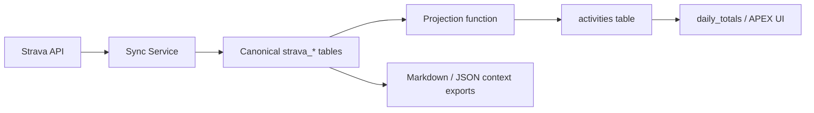

# Supabase Strava Integration

## Purpose

This document explains how to integrate Strava activity sync into your existing Supabase APEX Daily Log schema without breaking the current app model.

The recommended approach is:

- keep your current `profile`, `daily_log`, `meals`, `food_items`, and `activities` tables
- add canonical `strava_*` tables beside them
- project Strava workouts into the existing `activities` table for the app UI

This gives you a clean source of truth for Strava and still keeps the APEX app simple.

## Why a Two-Layer Model

Your current `activities` table is a good app-facing summary table, but it is too flat to act as the only Strava backend.

Strava sync needs to preserve:

- stable Strava activity IDs
- raw payloads
- zones
- laps
- streams
- sync state
- webhook audit information
- delete/update tracking

That data belongs in dedicated `strava_*` tables.

The APEX app can then consume a projected summary row in `activities`.

## Recommended Model



## Canonical Tables

The migration adds:

- `strava_oauth_tokens`
- `strava_sync_state`
- `strava_webhook_events`
- `strava_activities`
- `strava_activity_zones`
- `strava_activity_laps`
- `strava_activity_streams`

These tables should be treated as the true Strava source of truth.

## Small Changes to the Existing `activities` Table

The migration also evolves the existing `activities` table with:

- `user_id`
- `source`
- `external_id`
- `started_at`
- `updated_at`
- `raw_source`

Why:

- `source` lets the same table hold both manual and Strava-projected activities
- `external_id` stores the Strava activity ID
- `started_at` makes date/time analysis easier
- `raw_source` preserves the original upstream payload

The key uniqueness rule is:

- `UNIQUE (source, external_id)`

That allows idempotent Strava upserts while still permitting many manual rows with `NULL` external IDs.

## Projection Strategy

The migration includes a helper function:

- `project_strava_activity_to_apex(p_strava_activity_id, p_day_type, p_user_id)`

That function:

1. loads the canonical `strava_activities` row
2. gets or creates the matching `daily_log`
3. maps Strava sport types into your existing APEX sport enum
4. builds summary `extra_stats`
5. builds `zones` JSON for the APEX card
6. upserts into the existing `activities` table
7. writes back the projected row IDs into `strava_activities`

This lets your app keep reading from `activities`, while the richer data remains canonical in `strava_*`.

## Sport Mapping

The migration includes:

- `map_strava_sport_to_apex_sport(p_sport_type text)`

Default mapping:

- `Ride`, `GravelRide`, `VirtualRide`, `EBikeRide` -> `cycling`
- `Run`, `TrailRun` -> `running`
- `Walk` -> `walking`
- `Hike` -> `hiking`
- `Swim` -> `swimming`
- `WeightTraining`, `Workout` -> `strength`
- everything else -> `default`

You can expand this later without changing the canonical Strava tables.

## How to Use It

1. Run your existing APEX schema first.
2. Run the Strava integration migration:

   [supabase/sql/2026-04-07_strava_integration.sql](/Users/REDONSX1/Documents/code/01 personal/strava-activity-sync/supabase/sql/2026-04-07_strava_integration.sql)

3. During Strava sync:
   - upsert canonical data into `strava_*`
   - call `project_strava_activity_to_apex(...)` for each synced activity

## Secrets and Environment Variables

Keep Supabase secrets in your local `.env` file for development and in your
deployment platform's encrypted environment variable store for hosted
environments.

Recommended values:

- `APEX_SUPABASE_URL`: project URL from Supabase project settings
- `APEX_SUPABASE_SERVICE_ROLE_KEY`: server-side key for backend writes
- `APEX_SUPABASE_SCHEMA`: schema name, usually `public`
- `VITE_SUPABASE_URL`: frontend/public project URL used by UI apps
- `VITE_SUPABASE_ANON_KEY`: frontend/public anon key
- `VITE_SUPABASE_USER_ID`: default frontend user identifier such as `sergio`
- `SUPABASE_DB_HOST`: direct Postgres host from Supabase connection settings
- `SUPABASE_DB_PORT`: usually `5432`
- `SUPABASE_DB_NAME`: usually `postgres`
- `SUPABASE_DB_USER`: usually `postgres`
- `SUPABASE_DB_PASSWORD`: database password from project settings
- `SUPABASE_DB_SSLMODE`: keep as `require`
- `SUPABASE_STORAGE_BUCKET`: planned bucket for shared context artifacts

Important note:

- The current Python runtime now supports projection into the existing APEX
  schema when `APEX_SUPABASE_URL` and `APEX_SUPABASE_SERVICE_ROLE_KEY` are set.
- Canonical `strava_*` storage in Supabase is still a later step.

For consistency with the rest of the APEX ecosystem, prefer the `APEX_*`
backend variable names in this service. Keep the `VITE_*` variables in frontend
projects or shared environment definitions when you want the same Supabase
project referenced from a UI.

## How to Test the Supabase Schema

You can validate the database design now, even before the Python runtime is
fully connected to Supabase.

### Step 1: Create the base schema

In Supabase SQL Editor:

1. Run your existing APEX schema that creates:
   - `profile`
   - `daily_log`
   - `meals`
   - `food_items`
   - `activities`
   - `food_db`
   - views and helper functions
2. Confirm that the tables appear in the Supabase Table Editor.

### Step 2: Run the Strava integration migration

Run:

- [supabase/sql/2026-04-07_strava_integration.sql](/Users/REDONSX1/Documents/code/01 personal/strava-activity-sync/supabase/sql/2026-04-07_strava_integration.sql)

After it completes, confirm you now have:

- `strava_oauth_tokens`
- `strava_sync_state`
- `strava_webhook_events`
- `strava_activities`
- `strava_activity_zones`
- `strava_activity_laps`
- `strava_activity_streams`

### Step 3: Test the projection flow manually

Run this seed insert in Supabase SQL Editor:

```sql
insert into strava_activities (
  strava_activity_id,
  user_id,
  name,
  sport_type,
  started_at,
  distance_m,
  moving_time_s,
  total_elevation_gain_m,
  average_heartrate,
  calories,
  load_score,
  load_source,
  raw_payload
) values (
  999001,
  'sergio',
  'Test Strava Activity',
  'Run',
  now(),
  10000,
  2700,
  120,
  150,
  650,
  75,
  'manual_test',
  '{}'::jsonb
)
on conflict (strava_activity_id) do update
set updated_at = now();
```

Then project it into your APEX-facing table:

```sql
select project_strava_activity_to_apex(999001, 'moderate', 'sergio');
```

Finally, verify the projected row:

```sql
select
  title,
  sport,
  source,
  external_id,
  started_at
from activities
where source = 'strava'
order by started_at desc;
```

### Step 4: Test zones

Insert a few zone rows:

```sql
insert into strava_activity_zones (
  strava_activity_id,
  user_id,
  zone_type,
  zone_index,
  seconds,
  min_value,
  max_value,
  raw_payload
) values
  (999001, 'sergio', 'heartrate', 1, 1200, 120, 140, '{}'::jsonb),
  (999001, 'sergio', 'heartrate', 2, 900, 141, 155, '{}'::jsonb),
  (999001, 'sergio', 'power', 1, 800, 0, 120, '{}'::jsonb);
```

Re-run:

```sql
select project_strava_activity_to_apex(999001, 'moderate', 'sergio');
```

Then inspect:

```sql
select title, zones
from activities
where source = 'strava' and external_id = '999001';
```

That confirms the projection function is building the app-facing `zones` JSON.

## Runtime Projection in This Repo

The backend can now project locally synced Strava activities into the existing
APEX schema without waiting for the full canonical Supabase migration.

Current behavior:

- Strava sync still stores canonical activity data in the configured local
  backend
- when `APEX_SUPABASE_URL` and `APEX_SUPABASE_SERVICE_ROLE_KEY` are configured,
  each synced activity is also mirrored into the existing APEX `activities`
  table for the right day
- the backend uses the existing `get_or_create_daily_log(...)` database
  function, so meal slots and targets are created the same way as the rest of
  the app

Manual test command:

```bash
uv run strava-sync project-apex
```

That command reads locally stored activities and projects them into Supabase, so
you can test the integration immediately without waiting for new Strava
webhooks.

## What This Buys You

- a clean Strava backend
- no need to overload the current `activities` table
- compatibility with the existing APEX views
- better support for AI exports and future analytics

## Recommended Next Step

After this SQL migration, the next implementation step should be:

- refactor the Python service to use Supabase Postgres for canonical Strava storage
- optionally publish Markdown and JSON shared-context artifacts into Supabase Storage

That way:

- Postgres becomes the canonical Strava backend
- your APEX app keeps reading projected rows from `activities`
- the AI layer still gets structured context artifacts
